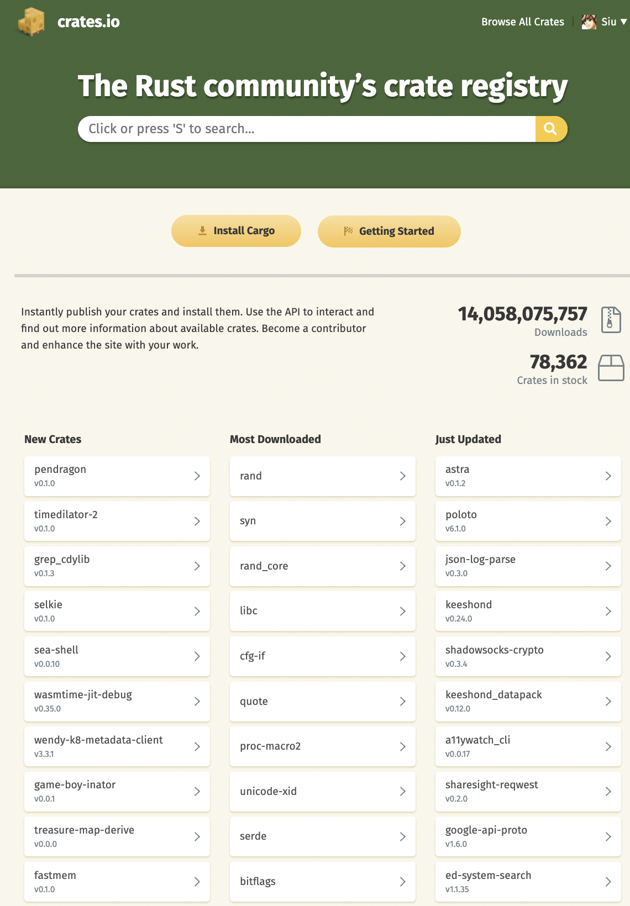

# Rust 世界

## Rust 的发展历程
&#8195;&#8195; Rust是由Mozilla主导开发的通用、编译型编程语言。设计准则为“安全、并发、实用”，支持函数式、并发式、过程式以及面向对象的程序设计风格。

&#8195;&#8195; Rust语言原本是Mozilla员工Graydon Hoare的私人计划，而Mozilla于2009年开始赞助这个计划，并且在2010年首次公开。也在同一年，其编译器源代码开始由原本的OCaml语言转移到用Rust语言，进行bootstrapping工作，称做“rustc”，并于2011年实际完成。这个可自我编译的编译器在架构上采用了LLVM做为它的后端。

&#8195;&#8195; 第一个有版本号的Rust编译器于2012年1月发布。Rust 1.0是第一个稳定版本，于2015年5月15日发布。

&#8195;&#8195; Rust在完全开放的情况下开发，并且相当欢迎社区的反馈。在1.0稳定版之前，语言设计也因为透过撰写Servo网页浏览器排版引擎和rustc编译器本身，而有进一步的改善。它虽然由Mozilla资助，但其实是一个共有项目，有很大部分的代码是来自于社区的贡献者。

&#8195;&#8195; 2021年 2 月 9 日，Rust 基金会宣布成立，由 AWS、华为、谷歌、微软和 Mozilla 联合成立，并承诺在两年的时间里，投入 100 万美元的预算，用于 Rust 项目的开发、维护和推广。

##  Rust 语言的特点
 - 高性能 - Rust 速度惊人且内存利用率极高。由于没有运行时和垃圾回收，它能够胜任对性能要求特别高的服务，可以在嵌入式设备上运行，还能轻松和其他语言集成。

 - 可靠性 - Rust 丰富的类型系统和所有权模型保证了内存安全和线程安全，让您在编译期就能够消除各种各样的错误。

 - 生产力 - Rust 拥有出色的文档、友好的编译器和清晰的错误提示信息， 还集成了一流的工具 —— 包管理器和构建工具， 智能地自动补全和类型检验的多编辑器支持， 以及自动格式化代码等等。

## C++、Java & Rust

...
你看C++就很相信人类，它要求人类自己把自己new出来的东西给delete掉。


C++：“这点小事我相信你可以的！”

人类：“没问题！包在我身上！”然后呢，内存泄漏、double free、野指针满世界飘……
C++：“……”


Java选择不相信人类，但替人类把事办好。

Java：“别动，让我来，我有gc！”

人类：“你怎么做事这么慢呀？你怎么还stop the world了呀？你是不是不爱我了呀？

”Java：“……”


Rust发现唯一的办法就是既不相信人类，也不惯着人类。

Rust：“按老子说的做，不做就不编译！”

人类：“你反人类！”

Rust：“滚！”

```txt
作者：左之了
链接：https://www.zhihu.com/question/328066906/answer/708085473
来源：知乎
``````
## Rust 学习曲线

学习曲线的高低，依个人水平不同而不同。以下罗列了不同基础学习 Rust 应该注意的地方。

- 完全零基础的开发者：掌握计算机基础体系知识结构，理解Rust语言和硬件/OS层的抽象，理解Rust语言核心概念、以及它的抽象模式，选择Rust语言的某个适用领域进行实操训练，通过实践来提升Rust语言的熟练度和理解深度，同时掌握领域知识。
- 有C语言基础：由于C语言开发者对高级语言的抽象不是很理解，所以着重了解掌握Rust所有权机制，包括所有权的语义，生命周期和借用检查。了解Rust语言的抽象模式，主要是类型和trait；以及Rust本身的的OOP和函数式语言特性。
- 有C++基础：C++开发者对于Rust语言的所有权有很好的理解能力，主要精力放在Rust的抽象模式和函数式语言特性上。
- 有Java/Python/Ruby基础：着重理解攻克Rust所有权机制、抽象模式、函数式编程语言特性。
- 有Go基础：Go语言开发者比较容易理解Rust的类型和trait抽象模式，但Go也是GC语言，所以所有权机制和函数式语言特性是他们的学习重点。
- 有Haskell基础：Haskell系的开发者对Rust语言函数式特性能很好的理解，主要攻克所有权机制和OOP语言特性。

## Rust 生态


&#8195;&#8195; Rust 生态日趋丰富，很多基础库和框架都会以 包（crate） 的方式发布到 [crates.io](https://crates.io) ，截止目前，crates.io 上面已经有 **78362** 个 crate，总下载量已经达到 **14,058,075,757**次。



### Rust 的应用
Rust 语言可以用于开发：

 - 传统命令行程序 - Rust 编译器可以直接生成目标可执行程序，不需要任何解释程序。
 - Web 应用 - Rust 可以被编译成 WebAssembly，WebAssembly 是一种 JavaScript 的高效替代品。
  - 网络服务器 - Rust 用极低的资源消耗做到安全高效，且具备很强的大规模并发处理能力，十分适合开发普通或极端的服务器程序。
 - 嵌入式设备 - Rust 同时具有JavaScript 一般的高效开发语法和 C 语言的执行效率，支持底层平台的开发。

crates.io 上的一些统计信息：

```stat
命令行工具 （3133 crates）
no-std 库 （2778 crates）
开发工具（测试/ debug/linting/性能检测等， 2652 crates）
Web 编程 （1776 crates）
API 绑定 （方便 Rust 使用的特定 api 包装，比如 http api、ffi 相关api等，1738 crates）
网络编程 （1615 crates）
数据结构 （1572 crates）
嵌入式开发 （1508 crates）
加密技术（1498 crates）
异步开发（1487 crates）
算法 （1200 crates）
科学计算（包括物理、生物、化学、地理、机器学习等，1100 crates）
```


&#8195;&#8195; 除此之外，还有 WebAssembly 、编码、文本处理、并发、GUI、游戏引擎、可视化、模版引擎、解析器、操作系统绑定 等其他分类，也有不少库。

 ### 基础库和工具链

 常用知名基础库和工具链

其中已经涌现出不少优秀的基础库，都可以在 http://crates.io 首页里看到。这里罗列出一些：

```txt
序列化/反序列化：Serde
命令行开发：clap / structopt
异步/Web/网络开发： tokio / tracing /async-trait / tower / async-std tonic / actix-web /smol / surf / async-graphql / warp /tungstenite / encoding_rs / loom / Rocket
FFi 开发： libc / winapi / bindgen / pyo3 / num_enum / jni / rustler_sys/ cxx / cbindgen / autocxx-bindgen
API 开发: jsonwebtoken / validator / tarpc / nats / tonic/ protobuf / hyper / httparse / reqwest / url
解析器：nom / pest / csv / combine / wasmparser / ron / lalrpop
密码学： openssl / ring / hmac / rustls / orion / themis / RustCrypto
WebAssembly: wasm-bindgen/ wasmer / wasmtime / yew
数据库开发： diesel / sqlx / rocksdb / mysql / elasticsearch / rbatis
并发：crossbeam / parking_lot / crossbeam-channel / rayon / concurrent-queue/ threadpool / flume
嵌入式开发：embedded-hal / cortex-m / bitvec / cortex-m-rtic / embedded-dma / cross / Knurling Tools
测试：static_assertions / difference / quickcheck / arbitrary / mockall / criterion / proptest / tarpaulin/ fake-rs
多媒体开发： rust-av/ image/ svg / rusty_ffmpeg/ Symphonia/
游戏引擎和基础组件：glam / sdl2 / bevy / amethyst/ laminar/ ggez / tetra/ hecs/ simdeez/ rg3d / [rapier](https://github.com/dimforge/ra pier) / RustcraftNestadia/ naga/ Bevy Retro/ Texture Generator / building_blocks / rpg-cli / macroquad
TUI/GUI 开发：winit / gtk / egui / imgui / yew / cursive / iced / fontdue / tauri / druid
```

### 知名的 Rust 项目/产品
- TiKV： HTAP 数据库 TiDB 的 KV 存储
- Databend：The Modern Cloud Data Warehouse for Everyone.
- Yew：是一个设计先进的 Rust 框架，目的是使用 WebAssembly 来创建多线程的前端 web 应用。
- Apache Arrow-rs
- 飞书
- RustDesk
- Dropbox

### 试试在线 Playgroud
Rust 官方在线工具: [https://play.rust-lang.org/](https://play.rust-lang.org/)

### 强烈推荐读一读《Rust 生态版图调研报告》-张汉东

- https://zhuanlan.zhihu.com/p/456451233
- https://zhuanlan.zhihu.com/p/458046979


## Ref
 - [Rust 维基百科](https://zh.wikipedia.org/wiki/Rust)
 - [Rust 菜鸟教程](https://m.runoob.com/rust/rust-tutorial.html)
 - [知乎问题：如何看待 Rust 的应用前景？-张汉东](https://www.zhihu.com/question/30407715/answer/1956026359)
