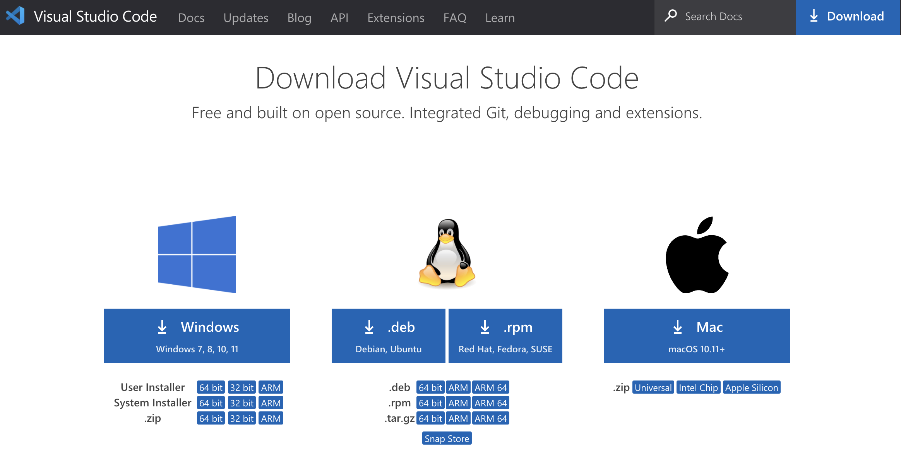
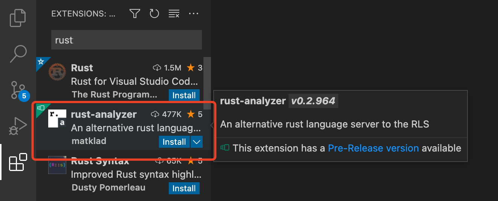

# 安装配置 IDE
## 官方推荐的 IDE
[官方](https://www.rust-lang.org/zh-CN/tools)推荐的 IDE 如下：

## 安装 VS Code

[下载地址](https://code.visualstudio.com/Download)

### 配置 Rust 插件

其它插件：

| 插件名        | 作用           |
| ----------- | -------------- |
| Better TOML | toml 文件插件  |
| Error Lens  | 错误展示更友好 |
| CodeLLDB    | debugger 插件  |

