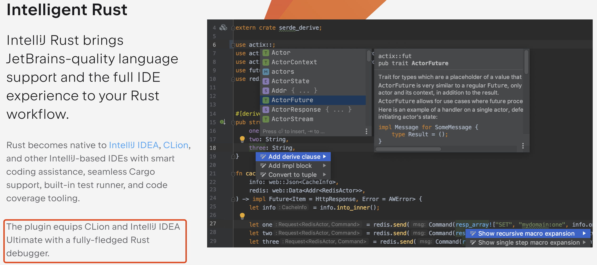
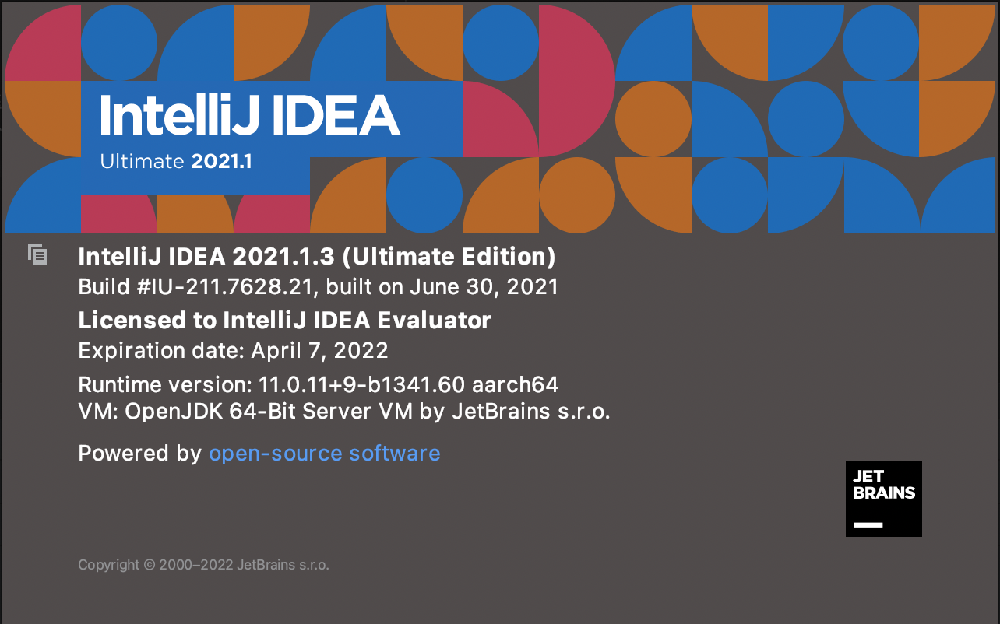
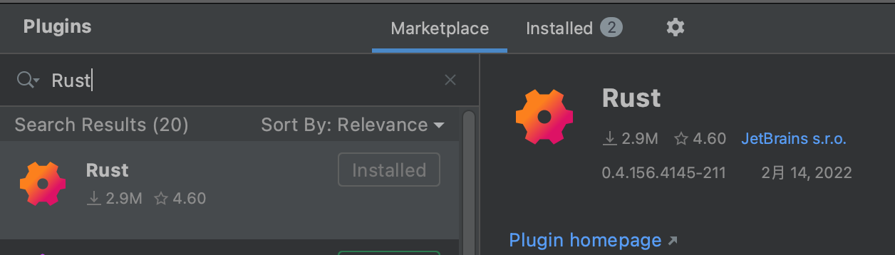

# IDEA Rust 配置

&#8195;&#8195; 熟悉 Java 的同学应该会比较熟 IDEA，是一个很棒的 IDE，对于已经有相对编程经历的我来说，切换一个 IDE 还是有点不习惯，所以还是回到 IDEA，这里记录一下 IDEA 中 Rust 的配置。如果你也是一个 Java-er，可以试试回到 IDEA，也可以体验一下 VS Code 看看。

***注：IDEA 的 [Rust 插件](https://www.jetbrains.com/rust/)只支持旗舰版  ）：***

## 步骤：

- [官方下载](https://www.jetbrains.com/zh-cn/idea/download/other.html)安装 IDEA （推荐 <=2021.1.x，这个版本比较容易重置试用期 ）

  

- Plugin 市场搜索 “Rust”，安装下面这个插件

  

- 重启就可以了

***以上配置也适用于 CLion***