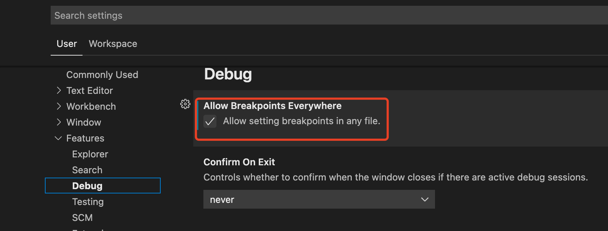
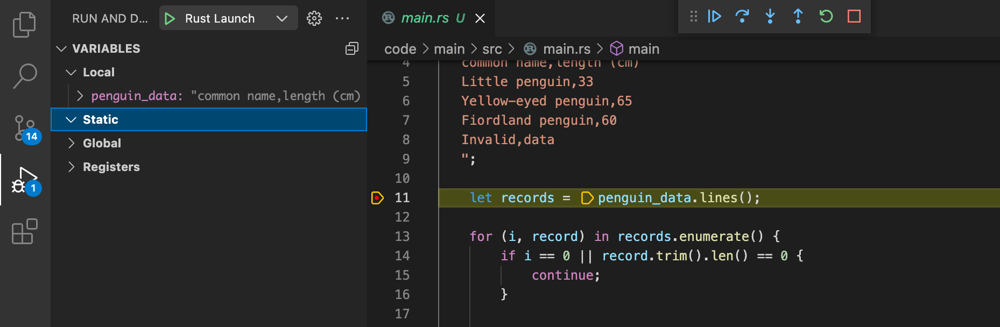

# VS Code debug 配置

&#8195;&#8195; debug 永远都是编码中最重要的环节，所以在第一个学习阶段，需要先学习一下这部分。


## 配置 Launch 

***注：先安装 CodeLLDB 插件***

`Run & Debug -> Add Configuration`

```json
{
    "version": "0.2.0",
    "configurations": [
        {
            "name": "Rust Launch",
            "type": "lldb",
            "request": "launch",
            "program": "${fileDirname}/../target/debug/${fileBasenameNoExtension}",
            "args": [],
            "cwd": "${workspaceRoot}",
        }
    ]
}
```

## 全局配置

`Code -> Preferences -> Settings`




## 设置一个断点，开始 debug




ref

https://www.forrestthewoods.com/blog/how-to-debug-rust-with-visual-studio-code/

https://code.visualstudio.com/docs/editor/variables-reference