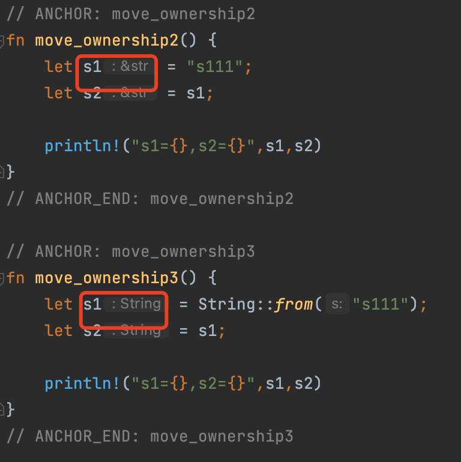

# 所有权

所有权是 Rust 的核心功能，Rust 用所有权系统去管理计算机内存。

所有程序必须去管理其运行时使用计算机内存的方式：

- 一些语言有垃圾回收机制，如：Go，Java，在运行时不断寻找不使用的内存；
- 另一些语言中，程序员必须自己手动分配和释放内存，如：C；
- Rust 则选择了第三种方式：用所有权系统管理内存
  
  而且这些都是编译器在编译时就已经完成的，不会影响程序的运行效率。

## C 的悬空指针

`悬空指针(Dangling pointer)` 是 C 语言中一个常见内存管理问题：

```c
int* foo(){
    int a;
    a = 5;
    char *c = "xyx";
    return &a;
}
```

> **补充知识点**
>
> - 1、局部变量存储在栈中
> - 2、全局变量、静态变量（全局和局部静态变量）存储在静态存储区
> - 3、new申请的内存是在堆中
> - 4、字符串常量也是存储在静态存储区
>
> 补充说明：
>
> - 1、栈中的变量内存会随着定义所在区间的结束自动释放；而对于堆，需要手动free，否则它就一直存在，直到程序结束；
> - 2、对于静态存储区，其中的变量常量在程序运行期间会一直存在，不会释放，且变量常量在其中只有一份拷贝，不会出现相同的变量和常量的不同拷贝。

上面这个函数被调用时返回函数内局部变量 `a` 的地址 `&a`,但是局部变量 a 是一个基本类型，存储在栈中，离开作用域时程序会申请的内存被系统回收，造成了悬空指针的问题。

而变量 c 是一个字符常量，存储在静态存储区，在程序运行期间会一直存在，直到程序退出。

## 知识点：栈和堆

> **知识点：栈和堆**
>
> 栈和堆是编程语言的核心数据结构，对于 Rust 这种系统级语言而言尤为重要，值存储在栈还是堆关系着程序的性能。
>
> 栈（Stack）
>
> 栈是先入后出（FILO），可以类比为叠盘子，增加一个盘子**只能**从顶部（入栈），取下一个盘子**只能**从顶部（出栈）。
>
> 栈中的所有数据都必须占用已知且固定大小的内存空间。
>
> 堆（Heap）
>
> 与栈不同，对于大小未知或者可能变化的数据，我们需要将它存储在堆上。
>
> 当向堆上放入数据时，需要请求一定大小的内存空间。操作系统在堆的某处找到一块足够大的空位，把它标记为已使用，并返回一个表示该位置地址的**指针**, 该过程被称为**在堆上分配内存（allocating on the heap）**，有时简称为 “分配”(allocating)。
>
> 接着，该指针会被推入**栈**中，因为指针的大小是已知且固定的，在后续使用过程中，你将通过栈中的**指针**，来获取数据在堆上的实际内存位置，进而访问该数据。
>
> 性能区别
>
> 写入方面：入栈比在堆上分配内存要快，因为入栈时操作系统无需分配新的空间，只需要将新数据放入栈顶即可。相比之下，在堆上分配内存则需要更多的工作，这是因为操作系统必须首先找到一块足够存放数据的内存空间，接着做一些记录为下一次分配做准备。
>
> 读取方面：栈数据往往可以直接存储在 CPU 高速缓存中（高速缓存和内存的访问速度差异在 10 倍以上！），而堆数据只能存储在内存中。访问堆上的数据比访问栈上的数据慢，因为必须先访问栈再通过栈上的指针来访问内存。
>
> 因此，处理器处理和分配在栈上数据会比在堆上的数据更加高效。

## 所有权与堆栈

当你的代码调用一个函数时，传递给函数的参数（包括可能指向堆上数据的指针和函数的局部变量）依次被压入栈中，当函数调用结束时，这些值将被从栈中按照相反的顺序依次移除。

因为堆上的数据缺乏组织，因此跟踪这些数据何时分配和释放是非常重要的，否则堆上的数据将产生内存泄漏 —— 这些数据将永远无法被回收。这就是 Rust 所有权系统为我们提供的强大保障。

对于其他很多编程语言，你确实无需理解堆栈的原理，但是在 Rust 中，明白堆栈的原理，对于我们理解所有权的工作原理会有很大的帮助。

## 所有权原则

理解了堆栈，接下来看一下关于所有权的规则，首先请谨记以下规则：

> - Rust 中的每一个值都有一个被称为其 所有者（owner）的变量。
> - 值在任一时刻有且只有一个所有者（owner）。
> - 当所有者（变量）离开作用域，这个值将被丢弃（drop）。

### 变量作用域（scope）

```rust
{{#include ../../../../code/main/src/main.rs:var_scope}}
```

### 转移所有权（move）

```rust
{{#include ../../../../code/main/src/main.rs:move_ownership1}}
{{#include ../../../../code/main/src/main.rs:move_ownership2}}
{{#include ../../../../code/main/src/.template:1:2}}
 move_ownership1();
 move_ownership2();
{{#include ../../../../code/main/src/.template:3:3}}
```

move_ownership1 中，值 5 绑定到变量 `x`，基本类型存储在栈中；将`x` 的值拷贝给 `y`，也存储在栈上。

因为整数是 Rust 基本数据类型，是固定大小的简单值，因此这两个值都是通过自动拷贝的方式来赋值的，都被存在栈中，完全无需在堆上分配内存。

这种方式也叫浅拷贝，浅拷贝只发生在栈上的数据。

再看看这段代码：

```rust
{{#include ../../../../code/main/src/main.rs:move_ownership3}}
{{#include ../../../../code/main/src/.template:1:2}}
 move_ownership3();
{{#include ../../../../code/main/src/.template:3:3}}
```

试试点击运行会抛出错误：`error[E0382]: borrow of moved value: `s1`，这其实就是 Rust 中的移动（move），s1 的所有权被转移了。

move_ownership2 和 move_ownership3 的代码有什么区别，通过IDE可以看到 s1 的数据类型是不一样的：

> move_ownership3 中 s1 持有了通过String::from("s111") 创建的值的所有权，move_ownership2 中只是是引用了存储在二进制中的字符串 "s111"，并没有持有所有权。



### 克隆(clone)

- Rust 永远也不会自动创建数据的 “深拷贝”。

- 需要深度复制 String 中堆上的数据，可以使用一个叫做 clone 方法：

  ```rust
  let s1 = String::from("hello");
  let s2 = s1.clone();
  
  println!("s1 = {}, s2 = {}", s1, s2);
  ```

  

### 拷贝(copy)
- 浅拷贝只发生在栈上，因此性能很高。

- Rust 有一个叫做 Copy 的特征，可以用在类似整型这样在栈中存储的类型。如果一个类型拥有 Copy 特征，一个旧的变量在被赋值给其他变量后仍然可用。

- 任何基本类型的组合可以 Copy ，不需要分配内存或某种形式资源的类型是可以 Copy 的。如下是一些 Copy 的类型：

  ```txt
  所有整数类型，比如 u32。
  布尔类型，bool，它的值是 true 和 false。
  所有浮点数类型，比如 f64。
  字符类型，char。
  元组，当且仅当其包含的类型也都是 Copy 的时候。比如，(i32, i32) 是 Copy 的，但 (i32, String) 就不是。
  不可变引用 &T ，例如转移所有权中的最后一个例子，但是注意: 可变引用 &mut T 是不可以 Copy的
  ```

  
